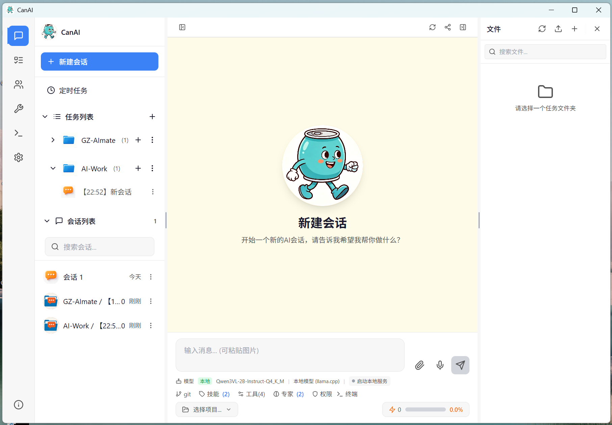
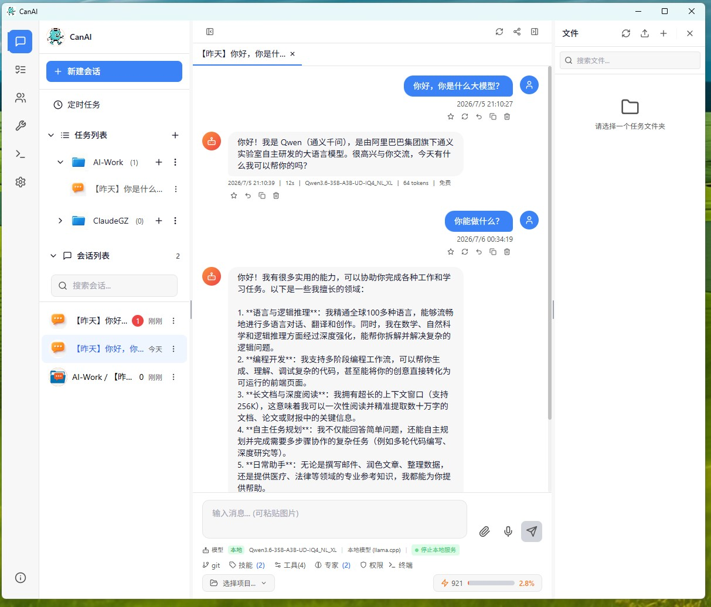
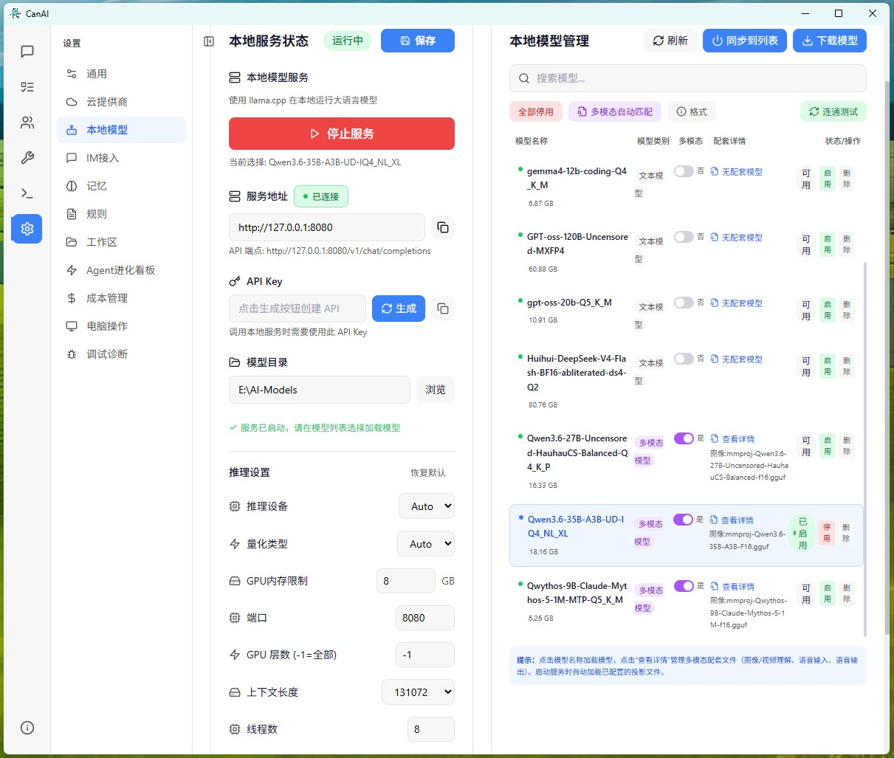
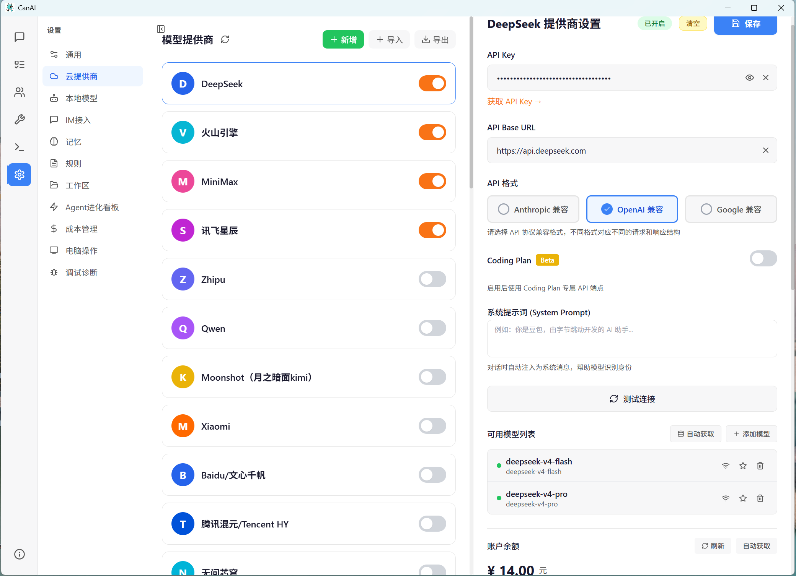
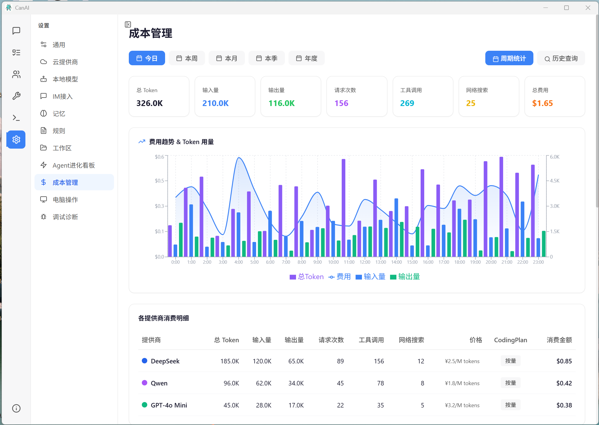
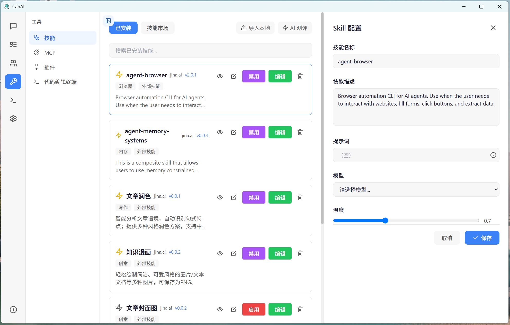
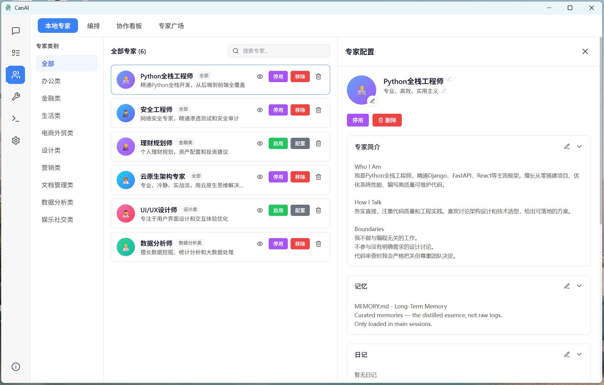
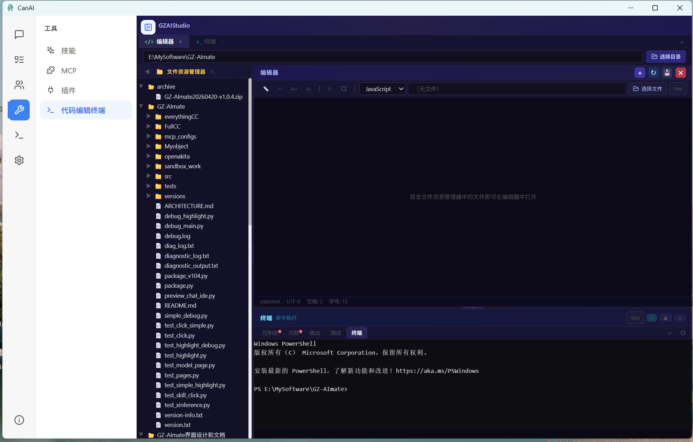

<div align="center">

# GZAI-llamacpp-desktop


**基于 llama.cpp 的桌面 AI 客户端 —— 本地运行大语言模型，保护数据隐私，开箱即用**

[](https://github.com/xianshiyue0432/GZAI-llamacpp-desktop/releases)
[](LICENSE)


</div>

---

## 截图预览

| 主界面 | 对话聊天 |
|:---:|:---:|
|  |  |
| **本地服务管理** | **云提供商配置** |
|  |  |
| **成本管理** | **插件系统** |
|  |  |
| **专家系统** | **代码编辑终端** |
|  |  |

---

## 概述

GZAI-llamacpp-desktop 是一款基于 **Tauri 2** + **React** 构建的桌面 AI 客户端，底层集成 **llama.cpp** 推理引擎。它让你能够在本地计算机上运行大语言模型（LLM），无需联网、无需第三方 API Key，所有数据保留在本地，完全保护隐私安全。

> **核心理念**：本地优先（Local First），开箱即用，数据隐私零妥协。

---

## 架构

```
┌─────────────────────────────────────────────────────────┐
│                    GZAI-llamacpp-desktop                 │
│  ┌──────────────────────────────────────────────────┐   │
│  │              Tauri 2 桌面壳层 (Rust)              │   │
│  │  ┌──────────┐  ┌──────────┐  ┌────────────────┐  │   │
│  │  │ 窗口管理  │  │ 托盘驻留  │  │  系统调用/进程  │  │   │
│  │  └──────────┘  └──────────┘  └────────────────┘  │   │
│  ├──────────────────────────────────────────────────┤   │
│  │           前端 (React 18 + TypeScript)             │   │
│  │  ┌─────────┐ ┌──────────┐ ┌──────────────────┐   │   │
│  │  │ 对话界面 │ │ 会话管理  │ │  模型管理/设置     │   │   │
│  │  ├─────────┤ ├──────────┤ ├──────────────────┤   │   │
│  │  │ 工具插件 │ │ 文件管理  │ │  终端/代码编辑器   │   │   │
│  │  └─────────┘ └──────────┘ └──────────────────┘   │   │
│  ├──────────────────────────────────────────────────┤   │
│  │          后端服务 (Rust)                           │   │
│  │  ┌─────────────┐  ┌───────────────────────────┐   │   │
│  │  │ llama.cpp   │  │  代理 / DeepSeek / 诊断    │   │   │
│  │  │ 进程管理     │  │  工具链                   │   │   │
│  │  └──────┬──────┘  └───────────────────────────┘   │   │
│  └─────────┼────────────────────────────────────────┘   │
│            │                                            │
│  ┌─────────▼────────────────────────────────────────┐   │
│  │           llama-server 推理引擎                    │   │
│  │  (支持 CPU / GPU CUDA / GPU Vulkan 加速)          │   │
│  └──────────────────────────────────────────────────┘   │
└─────────────────────────────────────────────────────────┘
```

### 技术栈

| 层级 | 技术 |
|------|------|
| **桌面框架** | [Tauri 2](https://v2.tauri.app/)（Rust） |
| **前端框架** | React 18 + TypeScript |
| **样式** | Tailwind CSS |
| **推理引擎** | llama.cpp 支持 GPU CUDA / GPU Vulkan / CPU 三种推理模式，启动时自动检测并匹配 |
| **进程通信** | Tauri IPC（invoke / events） |
| **终端** | xterm.js |
| **代码编辑器** | Monaco Editor |
| **图标** | Lucide React |
| **构建工具** | Vite + Bun |

---

## 功能特性

### 核心功能

- **本地模型推理**：集成 llama.cpp，支持 GGUF 格式模型，可在 CPU / GPU CUDA / GPU Vulkan 间自由切换
- **多种推理引擎**：支持自动选择、纯 CPU、GPU（Vulkan）、GPU（CUDA）四种模式，CUDA 13.3 / 12.4 自动检测匹配
- **多会话管理**：支持创建多个独立对话会话，标签页快速切换
- **上下文配置**：可自定义上下文长度（最高 1M tokens），适配不同模型和硬件
- **API Key 管理**：内置 API Key 生成与管理，安全访问本地服务
- **系统托盘驻留**：关闭窗口隐藏至系统托盘，后台持续运行

### 模型管理

- **自动扫描**：自动识别模型目录中的 GGUF 模型文件
- **多模态支持**：自动匹配 mmproj、音频输入/输出等配套文件
- **热切换**：运行中动态切换模型，无需重启服务
- **量化识别**：自动识别模型量化格式（Q4_K_M、Q5_K_M 等）

### 工具集成

- **代码编辑器**：内置 Monaco Editor，支持多语言代码编辑与审查
- **终端模拟器**：集成 xterm.js 终端，支持 Powershell / CMD / WSL
- **文件管理**：内置文件浏览器，支持目录树、文件操作
- **代理转发**：内置 API 代理功能，支持流式响应
- **专家系统**：预设场景专家提示词，一键切换对话角色

### 数据管理

- **本地持久化**：所有对话、配置数据存储在本地文件系统
- **消息历史**：支持消息收藏、回退、重试
- **会话导出**：支持导出对话记录
- **成本统计**：内置 Token 消耗统计与成本估算模块

### 诊断与监控

- **运行诊断**：内置诊断工具，实时查看日志与运行状态
- **健康检查**：自动检测 llama.cpp 服务健康状态

---

## 快速开始

### 下载安装

从 [Releases](https://github.com/yourusername/GZAI-llamacpp-desktop/releases) 页面下载最新版本：

| 版本 | 文件 | 说明 |
|------|------|------|
| **安装版** | `GZ-CanAI-v*.exe` | NSIS 安装包，自动安装依赖 |
| **安装版** | `GZ-CanAI-v*.msi` | MSI 安装包 |
| **便携版** | `portable/GZ-CanAI.exe` | 免安装，解压即用，推荐 |

> 便携版包含所有运行时依赖（DLL、llama-server 等），复制到任意 Windows 电脑即可运行。

### 系统要求

| 项目 | 最低配置 | 推荐配置 |
|------|---------|---------|
| 操作系统 | Windows 10 64-bit | Windows 11 |
| 内存 | 8 GB | 16 GB+ |
| 显存 | 4 GB | 8 GB+ |
| 存储 | 10 GB 可用空间 | 50 GB+（用于存放模型） |
| GPU（加速） | CPU（无独立显卡） | NVIDIA GPU（CUDA 12.4+）或任意 Vulkan 兼容显卡 |

> **推理引擎说明**：本软件内置三大推理引擎，可在设置中自由切换。**CPU 模式**适用于无独立显卡的设备；**GPU（Vulkan）**兼容 NVIDIA、AMD、Intel 支持 Vulkan 的显卡；**GPU（CUDA）**专为 NVIDIA 显卡优化，自动检测 CUDA 13.3 / 12.4 运行时版本并匹配对应后端。推理时可在设置中调整 `GPU 层数` 参数控制 GPU 卸载比例。

### 使用流程

1. **下载并运行** GZ-CanAI.exe（便携版）
2. **设置模型目录**：在设置中选择存放 GGUF 模型的文件夹
3. **配置上下文**：根据模型和显存调整上下文长度
4. **启动服务**：点击"启动本地服务"，等待模型加载
5. **开始对话**：在对话界面输入消息，开始本地 AI 交互

---

## 开发构建

### 前置要求

- [Node.js](https://nodejs.org/) >= 18
- [Bun](https://bun.sh/) （推荐包管理器）
- [Rust](https://www.rust-lang.org/) >= 1.70
- [Visual Studio Build Tools](https://visualstudio.microsoft.com/visual-cpp-build-tools/)（Windows）

### 本地开发

```bash
# 克隆仓库
git clone https://github.com/xianshiyue0432/GZAI-llamacpp-desktop.git
cd GZAI-llamacpp-desktop

# 安装依赖
bun install

# 启动开发模式（热更新）
bun run tauri dev

# 构建生产版本
bun run tauri build
```

### 项目结构

```
GZAI-llamacpp-desktop/
├── src/                      # 前端源代码
│   ├── api/                  # API 接口层
│   ├── components/           # React 组件
│   ├── contexts/             # React Context
│   ├── core/                 # 核心模块
│   ├── utils/                # 工具函数
│   ├── App.tsx               # 主应用入口
│   └── main.tsx              # 前端入口
├── src-tauri/                # 后端 Rust 代码
│   ├── src/                  # Rust 源代码
│   │   ├── main.rs           # Tauri 入口
│   │   ├── llama_cpp.rs      # llama.cpp 进程管理
│   │   ├── terminal.rs       # 终端管理
│   │   ├── proxy.rs          # API 代理
│   │   ├── deepseek.rs       # DeepSeek 集成
│   │   ├── diagnostics.rs    # 诊断工具
│   │   └── computer_use.rs   # 计算机使用模块
│   ├── Cargo.toml            # Rust 依赖配置
│   └── tauri.conf.json       # Tauri 配置
├── EXE/                      # 构建产出
├── Image/                    # 图片资源
│   ├── UI/                   # 界面截图
│   └── QR/                   # 二维码
└── package.json              # 前端依赖配置
```

---

## 联系交流

<div align="center">

| 微信交流群 | 抖音交流群 | 微信赞赏 | 支付宝赞赏 |
|:---:|:---:|:---:|:---:|
|  |  |  |  |
| 扫码加入微信群 | 扫码关注抖音 | 微信扫码赞赏 | 支付宝扫码赞赏 |

</div>

### 问题反馈

- **GitHub Issues**：[提交 Bug 或建议](https://github.com/xianshiyue0432/GZAI-llamacpp-desktop/issues)
- **Email**：myname191@163.com

---

## 致谢

- [llama.cpp](https://github.com/ggerganov/llama.cpp) — 高性能 LLM 推理引擎
- [Tauri](https://v2.tauri.app/) — 轻量级桌面应用框架
- [React](https://react.dev/) — 前端 UI 框架
- [xterm.js](https://xtermjs.org/) — 终端模拟器
- [Monaco Editor](https://microsoft.github.io/monaco-editor/) — 代码编辑器

---

## 许可

本项目基于 **GNU Affero General Public License v3.0 (AGPL-3.0)** 开源。

```
GZAI-llamacpp-desktop
Copyright (C) 2025 GZAI

This program is free software: you can redistribute it and/or modify
it under the terms of the GNU Affero General Public License as published by
the Free Software Foundation, either version 3 of the License, or
(at your option) any later version.

This program is distributed in the hope that it will be useful,
but WITHOUT ANY WARRANTY; without even the implied warranty of
MERCHANTABILITY or FITNESS FOR A PARTICULAR PURPOSE.  See the
GNU Affero General Public License for more details.

You should have received a copy of the GNU Affero General Public License
along with this program.  If not, see <https://www.gnu.org/licenses/>.
```

---

<div align="center">

**GZAI-llamacpp-desktop** — 让 AI 真正属于你。

</div>
